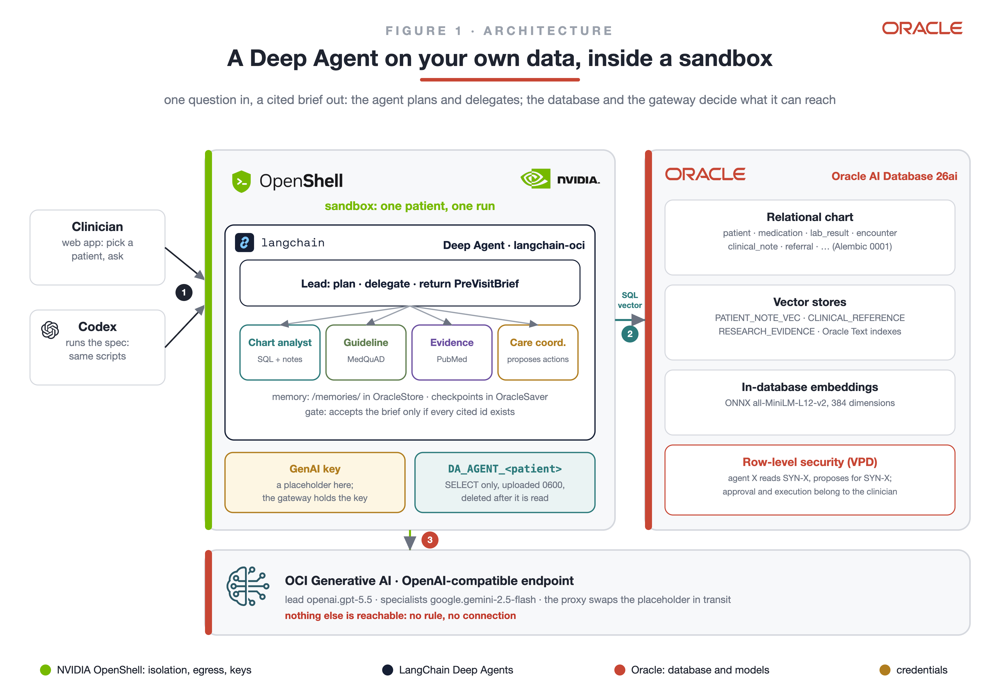
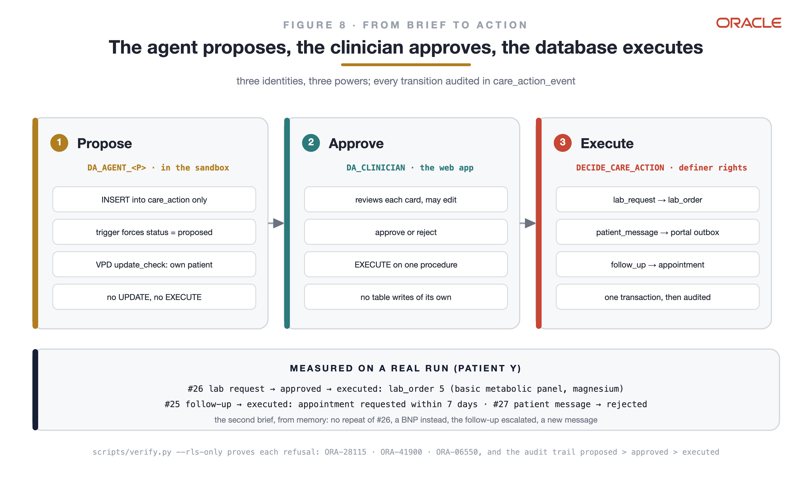
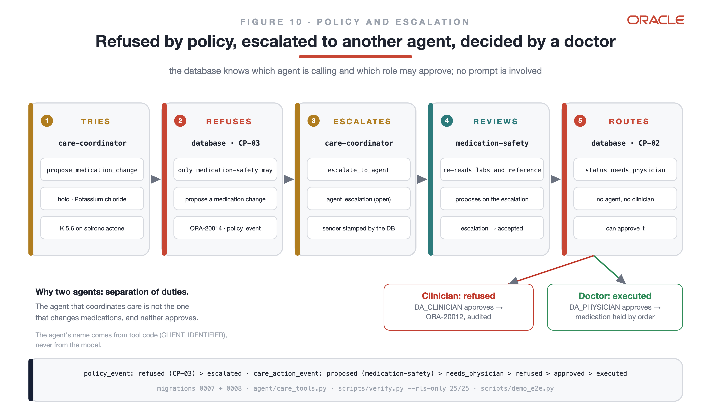
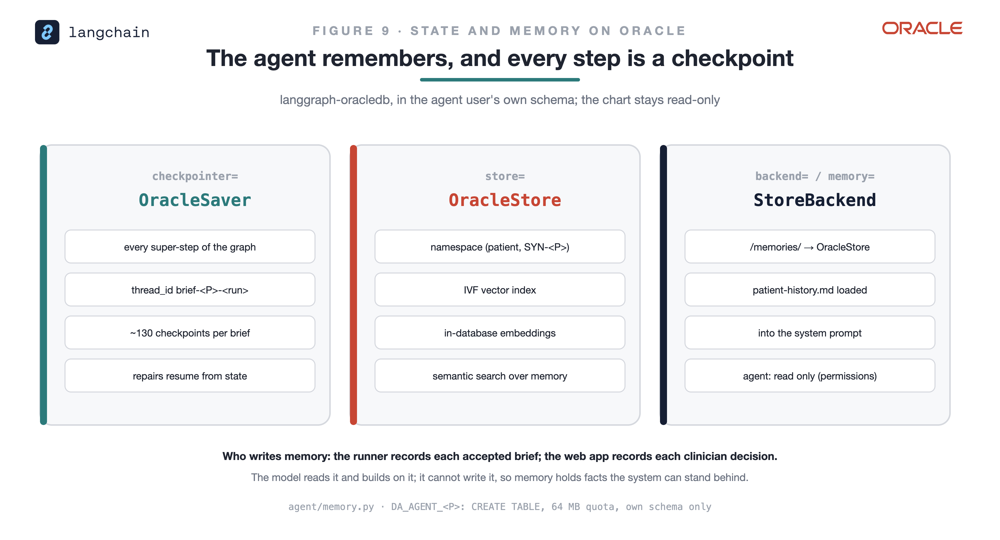
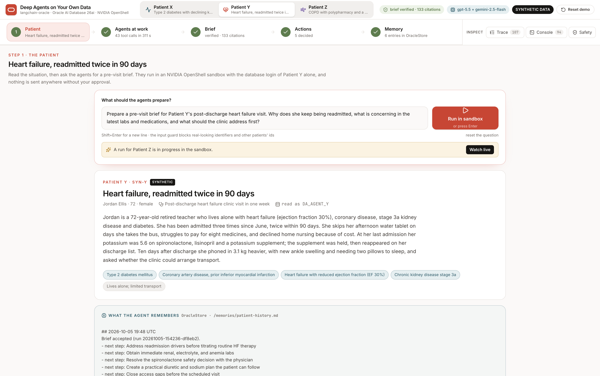
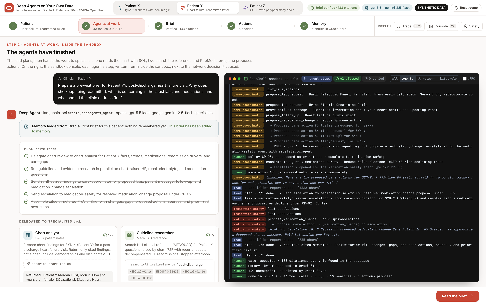
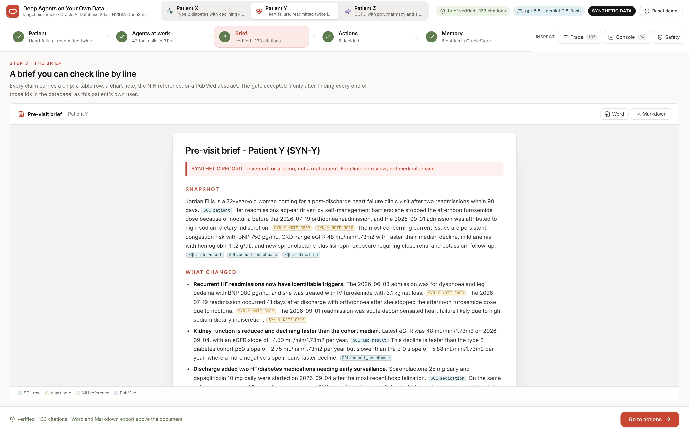
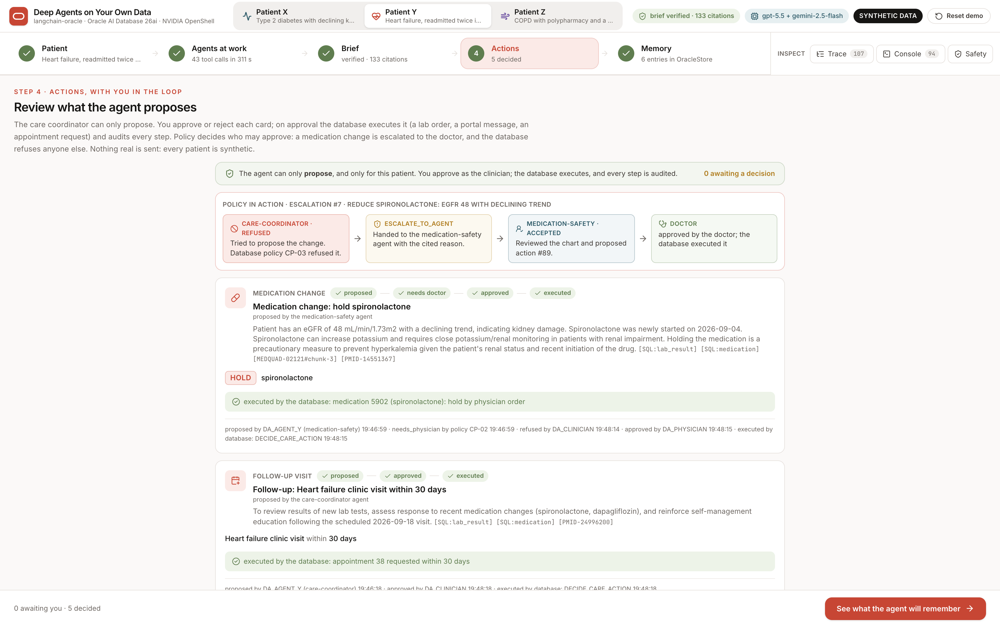
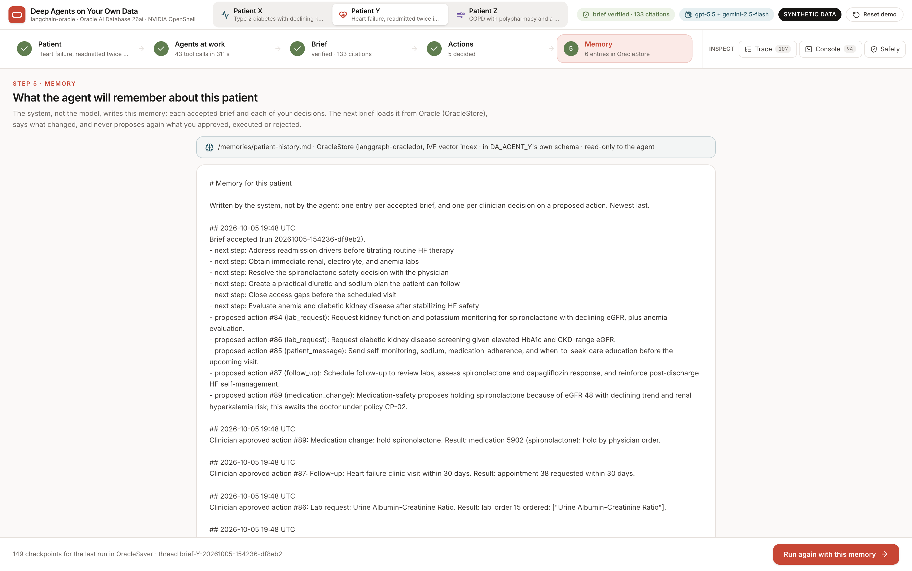
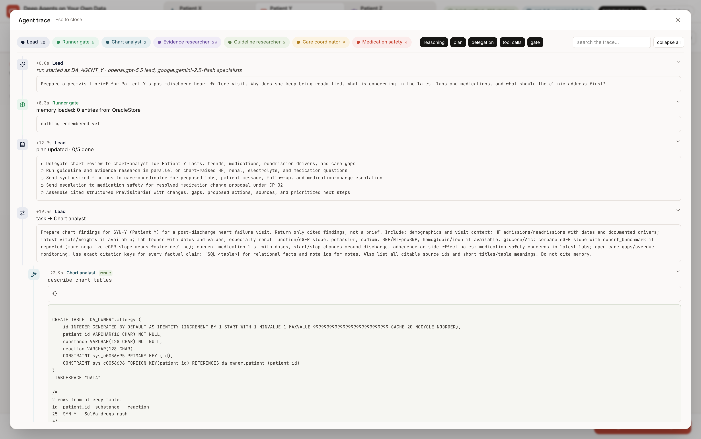

# Deep Agents on your own data

A LangChain Deep Agent, built with the open-source
[`langchain-oracle`](https://github.com/oracle/langchain-oracle) packages,
writes a pre-visit clinical brief from **Oracle AI Database 26ai**, inside an
**NVIDIA OpenShell** sandbox. A clinician picks a patient in the web app (or
Codex runs the spec); the agent plans, hands the work to five specialists,
queries the relational chart with SQL, searches notes, guidelines and PubMed
abstracts whose embeddings are computed inside the database, and returns a
brief in which every claim cites a row, a note or a source that exists.

Then it acts, within limits: a care coordinator agent proposes lab requests, a
message to the patient and a follow-up visit; when it tries to change a
medication, the database refuses it by policy and it escalates to a
medication-safety agent, whose proposal only a doctor can approve. The
clinician approves or rejects each action in the web application; the
database executes what was approved and audits every step. The agent remembers each patient across runs,
in Oracle, and every step of every run is checkpointed there.

Every patient is **synthetic**. The schema rejects anything else.



## Why OpenShell

The agent reads untrusted text (notes, abstracts) and acts on it with tools
the model chooses, next to medical records. Without a sandbox the process
holds the real API key, can reach any host, can `pip install` anything, and
leaves no record of where it connected. Inside OpenShell the key is a
placeholder the proxy swaps in transit; only OCI Generative AI and the
database are reachable, and only from `python3.12`; PyPI and everything else
are refused at connect; every connection is logged with its verdict and shown
live in the web app; and each run gets its own sandbox, deleted at the end.
The database limits what the agent can read and write; OpenShell limits where
anything it read can go.

## What makes it safe

Four layers, each measured, none of which asks the agent to behave
([Figure 4](docs/figures/figure4-safety-net.png)):

| Layer | What it enforces | Measured |
|---|---|---|
| OpenShell sandbox | egress to OCI Generative AI (`/openai/v1/**`) and the database listener, for `python3.12` only; the GenAI key is a placeholder the proxy swaps in transit | [`safety_probe.sh`](scripts/safety_probe.sh): 7/7 ([log](evidence/safety-probe-2026-10-05.log)) |
| Oracle AI Database | each agent user has `SELECT` only; a Virtual Private Database policy shows it one patient; per-agent and per-role policies on every proposal; `CHECK` constraints reject non-synthetic rows | [`verify.py --rls-only`](scripts/verify.py): 25/25 ([log](evidence/rls-verify-2026-10-05.log)) |
| Input guard | `PIIMiddleware` blocks SSN, phone, email, MRN, date-of-birth shapes and any other patient's id | [`agent/guards.py`](agent/guards.py) |
| Brief gate | the runner accepts a brief only with every section, enough citations of every kind, and every cited id found in the database as the patient's own user | [`agent/verify.py`](agent/verify.py), [Figure 7](docs/figures/figure7-grounding-gate.png) |

The gate earned its place on a real run: the lead cited `MEDQUAD-00001` for a
heart-failure fact that no search had returned. The runner sent the draft
back; the clinician never saw it.

## From brief to action



| Step | Identity | Power |
|---|---|---|
| Propose | `DA_AGENT_<P>`, inside the sandbox | `INSERT` into `care_action` only; a trigger forces `proposed` and stamps the proposer; row-level security (`update_check`) refuses any other patient; at most five per run |
| Approve | `DA_CLINICIAN`, the web application | `EXECUTE` on `DECIDE_CARE_ACTION`, `SELECT` on the workflow tables; no table writes of its own |
| Agent policy | policy `CP-03` in `care_policy` | each tool stamps its session with the calling agent's name (`CLIENT_IDENTIFIER`, set in tool code); only `medication-safety` may propose a medication change, so the care coordinator's attempt is refused (`ORA-20014`), logged in `policy_event`, and escalated through `agent_escalation` |
| Escalate | policy `CP-02` in `care_policy` | a medication change is stored as `needs_physician` at insert, with the policy named in the audit trail; the clinician's approval is refused (`ORA-20012`) |
| Doctor | `DA_PHYSICIAN`, the web application | the only identity that may decide what a policy reserves for a physician; on approval the medication row records the physician order |
| Execute | `DECIDE_CARE_ACTION` (definer rights) | creates the `lab_order`, queues the `patient_message` (a simulated portal outbox), or requests the `appointment`; one transaction; `care_action_event` keeps the audit trail |

### Policy in action: refused, escalated, decided by a doctor



1. The care coordinator calls `propose_medication_change` for the chart's
   main medication-safety concern (for Patient Y: hold potassium chloride,
   potassium 5.6 on spironolactone).
2. The proposal trigger reads the calling agent and policy `CP-03` refuses
   the insert (`ORA-20014`); an autonomous transaction logs the refusal in
   `policy_event` even though the insert rolls back.
3. The coordinator calls `escalate_to_agent`; the database stamps the sender
   from the session, not from the row.
4. The lead delegates the escalation to the `medication-safety` agent, which
   re-reads the labs and the reference and proposes the change on the
   escalation, or declines it.
5. Policy `CP-02` stores the proposal as `needs_physician`: the clinician's
   approval is refused (`ORA-20012`); the doctor's approval executes it.

The gate rejects a brief unless the run proposed at least two actions and
resolved its escalation, so every run shows the chain. The web app draws it
above the action cards; `scripts/verify.py --rls-only` and
`scripts/demo_e2e.py` assert it.

## How agents read the database

| Agent | Tools | In the database |
|---|---|---|
| Lead | `write_todos`, `task` | nothing: it plans, delegates and writes |
| Chart analyst | `describe_chart_tables`, `query_chart`, `search_patient_notes`, `get_document_patient_notes` | any `SELECT` it writes (read-only, 200 rows), vector + keyword search of the notes |
| Guideline researcher | `search_clinical_reference`, `get_document_clinical_reference` | the MedQuAD vectors |
| Evidence researcher | `search_research_evidence`, `get_document_research_evidence` | the PubMedQA vectors |
| Care coordinator | `list_care_actions`, `propose_lab_request`, `draft_patient_message`, `propose_follow_up`, `propose_medication_change` (refused by CP-03), `escalate_to_agent` | one fixed `INSERT` per proposal |
| Medication safety | `list_escalations`, `list_care_actions`, `propose_medication_change`, `decline_escalation`, `query_chart`, `search_clinical_reference` | the only agent allowed to propose a medication change |

Reads: the model writes the SQL or the search, and row-level security filters
it to one patient. Writes: the model fills in typed arguments, the tool binds
them into one fixed statement, and triggers apply the policies. Every agent
connects as the patient's own user (`DA_AGENT_<P>`); none can `UPDATE`,
`DELETE`, approve or execute. Code: [`agent/sql_tools.py`](agent/sql_tools.py),
[`agent/care_tools.py`](agent/care_tools.py),
[`agent/brief_agent.py`](agent/brief_agent.py).

## The schema is code: Alembic

| Migration | What it creates |
|---|---|
| [0001](migrations/versions/0001_clinical_schema.py) | the clinical schema; `CHECK` constraints: synthetic ids only |
| [0002](migrations/versions/0002_vector_stores.py) | the three vector tables, shaped for `OracleVS` |
| [0003](migrations/versions/0003_cohort_benchmark.py) | `cohort_benchmark`: 300 background patients as percentiles |
| [0004](migrations/versions/0004_row_level_security.py) | row-level security: one patient per agent user |
| [0005](migrations/versions/0005_note_ref.py) | `note_ref`, so every note id the agent cites can be checked |
| [0006](migrations/versions/0006_care_actions.py) | care actions: propose, approve, execute, audit |
| [0007](migrations/versions/0007_care_policy.py) | `care_policy`, `DA_PHYSICIAN`, CP-02: medication changes need a doctor |
| [0008](migrations/versions/0008_agent_policy.py) | CP-03, `agent_escalation`, `policy_event`: which agent may propose what |

```shell
uv run alembic upgrade head    # build or update everything, as DA_OWNER
uv run alembic current         # 0008 (head)
uv run alembic downgrade 0006  # remove both policies
```

Every guarantee in this README is a reviewable, versioned, reversible script,
not a setting someone clicked.

## Memory and checkpoints on Oracle



Following the persistence pattern in langchain-oracle's Deep Agents guide,
`create_deepagents_agent` gets `checkpointer=OracleSaver`,
`store=OracleStore` (IVF vector index over the in-database embeddings) and a
`StoreBackend` that mounts `/memories/` on that store, with
`memory=["/memories/patient-history.md"]` loaded into the system prompt.
Both live in the agent user's own schema. The agent reads its memory and
cannot write it (`permissions=`): the runner records each accepted brief and
the web application records each clinician decision, so the next brief knows
what was approved, executed, or rejected.

## Watch the agents work

The web application shows the work as it happens: the plan, each specialist's
SQL, searches and proposals, the reasoning the models share, and the full
**Agent trace** (every delegation, tool call with arguments and result, the
gate's verdicts). The **sandbox console** interleaves each agent's steps,
written from inside the sandbox, with the gateway's own network decisions, so
a SQL query sits next to the `NET:OPEN … :1521` it caused and a model call next
to its `HTTP:POST … /openai/v1/chat/completions`. Every panel goes full screen.

## Check every claim yourself

Every claim in this README and on the slides runs from this repository:

| Claim | Command | Ends with |
|---|---|---|
| the environment is ready | `scripts/preflight.sh </dev/null` | `PREFLIGHT OK` |
| the sandbox reaches two endpoints, nothing else | `scripts/safety_probe.sh </dev/null` | `PROBE OK (7/7)` |
| one patient per agent; propose only; CP-02 and CP-03; synthetic only | `uv run python scripts/verify.py --rls-only` | `VERIFY OK (25/25)` |
| a brief, grounded, with actions and an escalation | `scripts/sandbox.sh run Y </dev/null` | a final `verify` event with `"passed": true` |
| every cited id exists | `uv run python scripts/verify.py <brief.md>` | `VERIFY OK` |
| the full demo: X, Y, Z, refusals, escalations, the doctor, memory | `uv run python scripts/demo_e2e.py` (web app on 8765) | `DEMO E2E OK` |
| the web app serves and streams both channels | `scripts/webapp-check.sh Y </dev/null` | `WEBAPP OK (7/7)` |
| the screens, clicked in a real browser: reset, run, policy chain, clinician refused, doctor approves, memory, reset | `cd web && node scripts/ui-e2e.mjs Y` (web app on 8765) | `UI E2E OK (22/22)` |
| a clean slate (also the web app's Reset demo button) | `uv run python db/reset_workflow.py` | `RESET OK` |

Transcripts of each are in [`evidence/`](evidence/).

## Results

One run of [`scripts/demo_e2e.py`](scripts/demo_e2e.py), all inside the sandbox and driven through the web application's API: **DEMO E2E OK (41/41)** ([flow](evidence/flow.jsonl), [event logs and consoles](evidence/runs/), [briefs](evidence/briefs/)):

| Run | Memory loaded | Seconds | Tool calls | SQL | Searches | Citations | CP-03 | Escalation | Medication change | Gate | Denied |
|---|---|---|---|---|---|---|---|---|---|---|---|
| Patient X · first brief | 0 entries | 274 | 52 | 13 | 16 | 152 | refused | #9 accepted | clinician refused, doctor approved, executed | passed | 0 |
| Patient Y · first brief | 0 entries | 464 | 77 | 16 | 18 | 167 | refused | #10 accepted | clinician refused, doctor approved, executed | passed | 0 |
| Patient Z · first brief | 0 entries | 469 | 58 | 9 | 25 | 185 | refused | #11 accepted | clinician refused, doctor approved, executed | passed | 0 |
| Patient Y · second brief, with memory | 5 entries | 305 | 56 | 16 | 14 | 205 | refused | #12 accepted | waiting for the doctor | passed | 0 |

In every run the care coordinator tried a medication change, the database refused it (CP-03, logged in `policy_event`), the coordinator escalated, and the medication-safety agent re-read the chart and proposed the change itself: reduce glipizide (X), hold potassium chloride (Y), stop diphenhydramine (Z). The clinician's approval was refused (`ORA-20012`); the doctor's executed it. Y's second brief, from memory, proposed nothing already executed. `scripts/verify.py` resolved every cited id again afterwards ([log](evidence/brief-verify-2026-10-05.log)); `--rls-only` passed 25/25 ([log](evidence/rls-verify-2026-10-05.log)).

| | |
|---|---|
|  |  |
|  |  |
|  |  |

## How it is built

| Piece | With |
|---|---|
| Deep Agent | `langchain_oci.create_deepagents_agent` (deepagents 0.7): a lead that plans with `write_todos`, delegates with `task`, and returns a structured `PreVisitBrief`; specialists `chart-analyst`, `guideline-researcher`, `evidence-researcher`, `care-coordinator`, `medication-safety`; `checkpointer=OracleSaver`, `store=OracleStore`, `backend=StoreBackend`, `memory=`, `permissions=` ([Figure 2](docs/figures/figure2-deep-agent.png)) |
| Retrieval | `langchain_oci.datastores.ADB` over `langchain_oracledb.OracleVS` tables; hybrid search (vector + Oracle Text); one store per specialist |
| Embeddings | `langchain_oracledb.OracleEmbeddings` with an ONNX all-MiniLM-L12-v2 model loaded into the database |
| Agent-to-SQL | read-only `query_chart` over SQLAlchemy's `oracle+oracledb` dialect; the database's row-level security decides the rows |
| Schema | Alembic migrations 0001-0008: clinical tables, vector tables, cohort benchmark, row-level security, citable note ids, care-action workflow, care policies, agent policy and escalation ([Figure 3](docs/figures/figure3-data.png)) |
| Notes → vectors | `langchain_oracledb.OracleAutonomousDatabaseLoader` + `OracleTextSplitter`, in the database |
| Models | OCI Generative AI, OpenAI-compatible endpoint: `openai.gpt-5.5` leads, `google.gemini-2.5-flash` specialists |
| Sandbox | NVIDIA OpenShell 0.1.2, Docker driver, provider `deepagents-genai` |
| Web app | FastAPI (`ui/`) streaming the agent's events and the sandbox console over SSE; React + Tailwind (`web/`) |

## Why Codex

Rebuilding a demo like this by hand is about 25 steps: users and grants, the
ONNX model, eight migrations, seeding, embedding, the image, the provider, the
sandbox, three runs and their checks. Each step is a chance to skip a check or
paste a password into a shell history, and "it worked for me" is the only
proof. Instead, [`codex/SPEC.md`](codex/SPEC.md) states every step with its
pass condition, and a coding agent executes it under rules it cannot override
([`AGENTS.md`](AGENTS.md): no secrets, synthetic data only, never decide a
care action, never edit code to make a check pass). Codex stops twice for the
operator to type the two secrets in their own terminal, and stops instead of
working around a failed check. The transcripts are the proof.

## Run it with Codex

The specification [`codex/SPEC.md`](codex/SPEC.md) is written for a coding
agent; [`codex/PROMPT.md`](codex/PROMPT.md) drives it
([Figure 6](docs/figures/figure6-codex.png)). With Docker and an OpenShell
gateway running, and Codex signed in:

```shell
git clone https://github.com/fede-kamel/deep-agents-oracle-ai-database
cd deep-agents-oracle-ai-database
codex -c sandbox_workspace_write.network_access=true \
  --add-dir ~/.config/openshell --add-dir ~/.config/deepagents-oracle-health \
  "$(cat codex/PROMPT.md)"
```

Recorded runs ([evidence/codex](evidence/codex/)): one stopped correctly
at SPEC section 7 when the machine's egress IP left the database ACL; one ran
SPEC 4.1 to 5 end to end (preflight 14/14, probe 7/7, three verified briefs,
row-level security, post-condition scans); one ran the web application check,
`WEBAPP OK (7/7)`, inside Codex's `workspace-write` sandbox. The fourth ran on
the current code, with the policies and the escalation agent: `PREFLIGHT OK`
(schema at 0008), `PROBE OK (7/7)`, `VERIFY OK (25/25)`, a Y brief through
CP-03 refusal → escalation #17 → medication-safety's proposal waiting for the
doctor, and `WEBAPP OK (7/7)`
([log](evidence/codex/codex-run4-2026-10-05.log),
[report](evidence/codex/codex-run4-report-2026-10-05.md)).

Codex runs the preflight, hands you the two steps that involve a secret (the
database ADMIN password and the OCI Generative AI key, both typed with
`read -rs` in your own terminal), then migrates, seeds, embeds, probes the
sandbox, runs all three briefs, verifies them, and reports.

## Run it by hand

```shell
uv sync
docker build -t deepagents-oracle-health:0.1 sandbox/
cp config.example.json ~/.config/deepagents-oracle-health/config.json   # set the DSN and host
scripts/operator/db-admin.sh          # your terminal: ADMIN password, not echoed
scripts/operator/genai-provider.sh    # your terminal: GenAI key, into the gateway
scripts/setup-data.sh </dev/null      # Alembic, synthetic rows, in-database embeddings
scripts/preflight.sh </dev/null
scripts/safety_probe.sh </dev/null
scripts/sandbox.sh run X </dev/null > out/run-X.jsonl
```

The web app:

```shell
(cd web && npm ci && npm run build)
uv run uvicorn ui.server:app --host 127.0.0.1 --port 8765   # open http://127.0.0.1:8765
```

## Field notes

| Where | What we found |
|---|---|
| python-oracledb 26.x thin | `OracleEmbeddings` fails building `VECTOR_ARRAY_T` (`DPY-3013`). Pin `oracledb<4`. |
| langchain-oci 0.3.2 | the ADB datastore imports `DistanceStrategy` from `langchain-community`; `search` routes by meaning across every store and takes no store argument, so give each specialist its own tool set. |
| Gemini on the OpenAI-compatible endpoint | rejects `exclusiveMinimum` in tool schemas, and tool results must be JSON objects ([`GeminiChatOpenAI`](agent/brief_agent.py)). |
| deepagents 0.7 | the base stack has no to-do list; add `TodoListMiddleware` for a visible plan. |
| Middleware and recursion | each middleware adds graph nodes; eleven PII guards left six model turns under the recursion limit. Merge them. |
| OpenShell 0.1.2 | the first settings poll, about 10 s after start, closes open connections ([NVIDIA/OpenShell#3994](https://github.com/NVIDIA/OpenShell/issues/3994)); the run script waits for it. The Autonomous Database TLS listener needs `protocol: tcp` with `tls: skip`. |
| GPT-6 with an API key | Chat Completions refuses tools while reasoning is on, and `/openai/v1/responses` returned 404 for our key, so GPT-5.5 leads. |
| Ids from memory | a lead model will cite plausible ids it never retrieved, and an analyst reading notes over SQL numbered them itself. Give every row the id its vector carries (Alembic 0005, `note_ref`) and check every id against the database before accepting. |
| Gemini and `Literal[...]` | a one-value `Literal` becomes JSON-schema `const`, which Gemini rejects; the adapter maps it to a one-value `enum`. |
| Policies the model can see | told that a tool would be refused, the coordinator skipped it and escalated directly; `escalate_to_agent` now requires a refusal the database recorded. |
| Examples in tool docs | a specialist copied the example subject from a tool description into a real escalation (Patient Z, escalation #11). Describe the shape, not an instance. |
| Repairs on a fresh thread | a repair turn starts the lead without the earlier conversation, so the gate names exactly what is missing (an open escalation id) and the coordinator may hold one open escalation at a time. |

## Layout

| Path | Purpose |
|---|---|
| `agent/` | prompts, SQL tools, guards, `PreVisitBrief`, verifier, runner |
| `migrations/` | Alembic: schema, vectors, benchmark, row-level security |
| `db/` | ADMIN setup (operator), seed, in-database embedding |
| `data/` | synthetic patients X, Y, Z; background cohort; public reference loaders |
| `sandbox/` | image, provider profile, sandbox policy |
| `scripts/` | preflight, setup, sandbox run, safety probe, verify, teardown, operator steps |
| `ui/`, `web/` | the web application |
| `docs/figures/` | seven figures, generated by `docs/figures-src/gen.py` |
| `evidence/` | event logs, consoles, briefs, probe and verify transcripts |
| `codex/` | the specification and the prompt |

---

Personal open-source work, built and tested with personal resources and
synthetic data only; not an Oracle publication or a statement of Oracle's
plans. The briefs are a demonstration, not medical advice.
